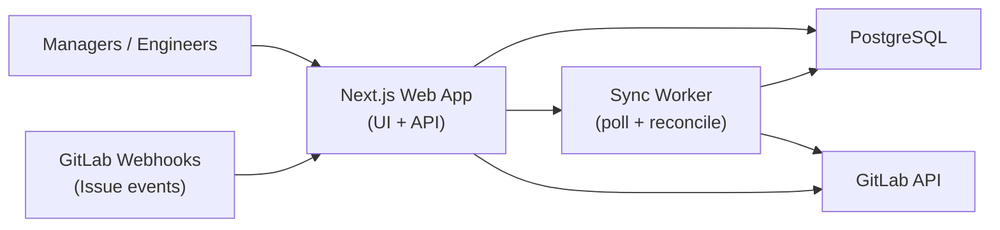

# Backtrak: Internal GitLab Backlog Tracking App (MVP Architecture)

## 1) High-Level Architecture

### Diagram

### Explanation
- A single TypeScript codebase hosts both frontend and backend APIs for speed and maintainability.
- GitLab issue changes enter via two paths:
- Webhooks for near real-time updates.
- Scheduled polling for reconciliation (missed events, delayed webhooks, data drift).
- PostgreSQL stores normalized issue data plus internal-only metadata (notes, flags, targets).
- Dashboard endpoints read from PostgreSQL, so management gets fast filtering/reporting without hitting GitLab live.

## 2) Tech Stack (With Justification)

### Frontend
- **Framework:** Next.js (App Router) + TypeScript
- **UI Kit:** shadcn/ui + Tailwind CSS
- **Table:** TanStack Table
- **Data fetching/cache:** TanStack Query
- **Why:** Fastest path to production with strong DX, typed code, and excellent table/filter support for backlog use cases.

### Backend
- **API layer:** Next.js Route Handlers (REST)
- **Validation:** Zod schemas for request/response validation
- **ORM:** Prisma
- **Background jobs:** Separate Node worker process in same repo (cron + queue table in Postgres)
- **Why:** One repo, one language, low cognitive load for a single maintainer.

### Package Manager and Toolchain
- **Package manager:** Bun (`bun.lock`)
- **Runtime/tooling:** Use Bun for install/scripts/dev workflow.
- **Project bootstrap:** `bun create next-app`
- **Linting:** `oxlint`
- **Formatting:** `oxfmt`
- **CI quality gate:** Run `oxfmt --check .` and `oxlint .` on pull requests.
- **Why:** Bun keeps the dev loop fast, while `oxlint`/`oxfmt` provide very fast, consistent code quality checks.

### Database
- **PostgreSQL** (managed)
- **Why:** Reliable, easy relational modeling for issues/projects/assignees/labels, excellent filtering/query performance.

### Auth
- **better-auth with Google Workspace OAuth provider** and company-domain allowlist
- **Session model:** Server-side sessions stored in PostgreSQL (via Prisma)
- **Roles:** `viewer`, `manager`, `admin` (stored on app user record)
- **Why:** Modern TypeScript-first auth, easy role customization, and minimal operational overhead for an internal tool.

### Testing
- **Unit/integration:** Vitest
- **Component testing:** React Testing Library
- **End-to-end:** Playwright
- **API mocking:** MSW (mock GitLab API + edge cases)
- **Why:** Strong Next.js compatibility and a fast, reliable test pyramid that keeps regressions low for a small team.

## 3) Database Schema

## Core tables

### `projects`
- `id` (uuid, pk)
- `gitlab_project_id` (bigint, unique)
- `name` (text)
- `path_with_namespace` (text)
- `web_url` (text)
- `active` (boolean)
- `created_at`, `updated_at`

### `gitlab_users`
- `id` (uuid, pk)
- `gitlab_user_id` (bigint, unique)
- `username` (text)
- `name` (text)
- `email` (text, nullable)
- `avatar_url` (text, nullable)
- `created_at`, `updated_at`

### `issues`
- `id` (uuid, pk)
- `project_id` (uuid, fk -> `projects.id`)
- `gitlab_issue_id` (bigint)
- `iid` (int)  // GitLab per-project issue number
- `title` (text)
- `description` (text, nullable)
- `state` (enum: `opened`, `closed`)
- `created_at_gitlab` (timestamp)
- `updated_at_gitlab` (timestamp)
- `closed_at_gitlab` (timestamp, nullable)
- `due_date` (date, nullable)
- `author_id` (uuid, fk -> `gitlab_users.id`, nullable)
- `web_url` (text)
- `synced_at` (timestamp)
- Unique: (`project_id`, `gitlab_issue_id`)

### `issue_assignees`
- `issue_id` (uuid, fk -> `issues.id`)
- `user_id` (uuid, fk -> `gitlab_users.id`)
- PK: (`issue_id`, `user_id`)

### `labels`
- `id` (uuid, pk)
- `title` (text)
- `color` (text)
- `project_id` (uuid, nullable fk -> `projects.id`) // null if group/global semantics
- Unique: (`project_id`, `title`)

### `issue_labels`
- `issue_id` (uuid, fk -> `issues.id`)
- `label_id` (uuid, fk -> `labels.id`)
- PK: (`issue_id`, `label_id`)

## Internal tables

### `app_users`
- `id` (uuid, pk)
- `email` (text, unique)
- `name` (text)
- `role` (enum: `viewer`, `manager`, `admin`, default `viewer`)
- `created_at`, `updated_at`

### `issue_overrides`
- `issue_id` (uuid, pk, fk -> `issues.id`)
- `internal_status` (enum: `not_started`, `in_progress`, `blocked`, nullable)
- `internal_notes` (text, nullable)
- `target_date` (date, nullable)
- `priority` (int, nullable)
- `updated_by` (text)
- `updated_at` (timestamp)

### `issue_status_events`
- `id` (uuid, pk)
- `issue_id` (uuid, fk -> `issues.id`)
- `from_status` (text, nullable)
- `to_status` (text)
- `changed_at` (timestamp)
- `source` (enum: `webhook`, `poll`, `manual`)

### `sync_cursors`
- `project_id` (uuid, pk, fk -> `projects.id`)
- `last_seen_updated_at` (timestamp)
- `last_success_at` (timestamp)
- `last_error` (text, nullable)

### `sync_runs`
- `id` (uuid, pk)
- `mode` (enum: `bootstrap`, `poll`, `reconcile`, `webhook`)
- `status` (enum: `running`, `success`, `failed`)
- `project_id` (uuid, nullable)
- `started_at`, `finished_at`
- `records_upserted` (int default 0)
- `error_message` (text, nullable)

## Useful indexes
- `issues(state, updated_at_gitlab desc)`
- `issues(project_id, state)`
- `issues(closed_at_gitlab)`
- `issues(due_date)`
- `issue_assignees(user_id, issue_id)`
- `labels(title)`
- `issue_status_events(issue_id, changed_at)`

## 4) API Design (REST)

### Issues
- `GET /api/issues`
- Filters: `assignee`, `status`, `project`, `label`, `created_from`, `created_to`, `updated_from`, `updated_to`, `completed_from`, `completed_to`, `in_progress_days_gt`, `overdue`, `q`, `page`, `page_size`, `sort`
- `GET /api/issues/:id`
- `PATCH /api/issues/:id/override` (internal notes/metadata only)

### Dashboard
- `GET /api/dashboard/summary`
- Returns: in progress count, completed count, overdue count, not started count
- `GET /api/dashboard/tasks-per-engineer`
- `GET /api/dashboard/cycle-time?from=YYYY-MM-DD&to=YYYY-MM-DD`
- `GET /api/dashboard/completed?from=YYYY-MM-DD&to=YYYY-MM-DD`

### Search
- `GET /api/search?q=...`
- Searches title, description, labels, project name, assignee.

### Sync/Admin
- `POST /api/sync/bootstrap` (admin)
- `POST /api/sync/reconcile` (admin)
- `GET /api/sync/status` (admin)
- `POST /api/webhooks/gitlab` (GitLab webhook receiver with secret verification)

## 5) GitLab Sync Strategy

Use **hybrid sync**: webhooks + polling.

### Why hybrid
- Webhooks provide near real-time updates.
- Polling guarantees eventual consistency when webhooks fail or are delayed.

### Flow
1. **Bootstrap:** For each tracked project, fetch all open issues and recent closed issues (e.g., last 90 days).
2. **Webhook ingest (primary):** On `issue` events, fetch canonical issue payload (or trust webhook payload if sufficient), then upsert.
3. **Incremental polling (safety net):** Every 5-10 minutes, call GitLab with `updated_after=cursor`.
4. **Nightly reconcile:** Re-scan open issues + recently updated issues to heal drift.
5. **Idempotency:** Upsert by (`project_id`, `gitlab_issue_id`) and use transaction boundaries.
6. **Rate limiting/backoff:** Concurrency limit + exponential retry for 429/5xx responses.

### Polling vs Webhooks decision
- **Webhooks only:** Fast but brittle if events are dropped.
- **Polling only:** Simpler but stale and more API load.
- **Chosen approach:** Hybrid, because it keeps implementation simple while preserving trust in management reports.

## 6) Deployment Plan (Simple + Cost-Effective)

## Deployment setup
- **Platform:** Render or Railway
- **Services:**
- `web` service (Next.js app + APIs)
- `worker` service (sync jobs)
- Managed PostgreSQL
- **CI/CD:** GitLab CI or GitHub Actions to deploy on main branch.

## Security/internal access
- Restrict access via better-auth + Google Workspace OAuth + company domain allowlist.
- Optionally add VPN or Cloudflare Access for network-level restriction.
- Store GitLab token/webhook secret, Google OAuth client credentials, and better-auth secret in platform secrets.

## Cost profile (small internal team)
- Managed Postgres + 2 small app services is typically low monthly cost and far cheaper than paid PM tools.

## 7) MVP Roadmap (4 Weeks)

### Week 1: Foundation
- Set up Next.js, Prisma, Postgres, and better-auth.
- Add quality tooling: `oxlint` + `oxfmt`, with scripts and CI checks.
- Add test tooling: Vitest + React Testing Library + Playwright + MSW.
- Implement GitLab project connection + bootstrap sync.
- Build webhook endpoint and sync worker skeleton.

### Week 2: Backlog Table
- Unified issues table with pagination/sorting.
- Filters: assignee, status, project, label, dates.
- Global search.

### Week 3: Dashboards
- Summary KPIs: in progress/completed/overdue/not started.
- Tasks per engineer.
- Cycle time and completion trend charts.

### Week 4: Hardening + Internal Metadata
- Internal notes/override fields.
- Reconcile job, retry logic, observability (logs/error tracking).
- Access control polish + acceptance testing with management.

## Non-Goals for MVP (to avoid overengineering)
- Real-time websockets.
- Complex workflow engines.
- Multi-tenant architecture.
- Advanced forecasting/AI features.

## Definition of Done for MVP
- Management can answer all current Google Sheets questions from one interface.
- Sync reliability is measurable (status page + last sync timestamp).
- Engineers no longer manually update tracking sheets.
